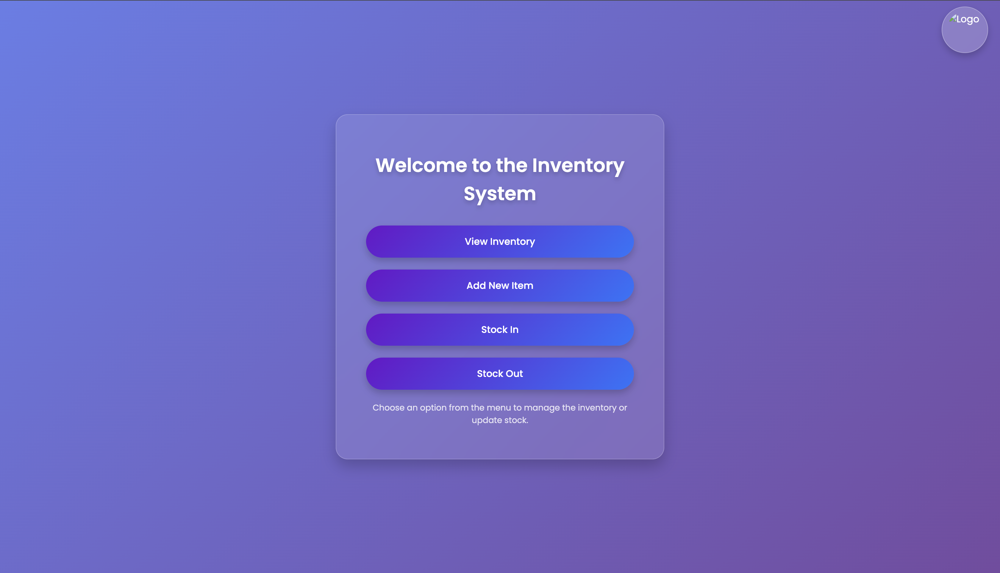

# 📦 Inventory Management System  

This is an enhanced version of an **Inventory Management System**. Originally developed by my friend, I helped fix issues and improve the system by enhancing its features and optimizing performance.  

---

## 🚀 Features  
- ✅ **View Inventory** – Browse all available items in the inventory.  
- ✅ **Add New Item** – Easily add new items with relevant details.  
- ✅ **Stock In** – Update stock quantities when new items arrive.  
- ✅ **Stock Out** – Deduct stock when items are dispatched.  

---

## 🛠 Technologies Used  
- **Frontend**: HTML, CSS, JavaScript  
- **Backend**: PHP  
- **Database**: MySQL  

---

## 📸 Project Preview  
  
*Screenshot of the system interface*  


## 📥 Installation & Setup  

### 1️⃣ Clone the Repository  
```bash
git clone https://github.com/your-username/inventory-management-system.git
cd inventory-management-system
